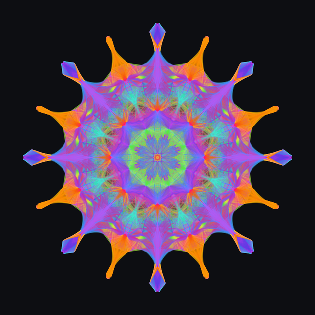

# Nekudot

[](LICENSE)
[](https://github.com/barakbl/nekudot/releases)
[](https://github.com/barakbl/nekudot/actions)
[](https://nekudot.app/app/)
[](https://nekudot.app/)

A browser-based **expressive drawing tool**. As you draw, Nekudot remembers
every point and weaves faint lines between nearby ones - so a single gesture
blooms into a web of its own. Inspired by
[mrdoob's Harmony](https://mrdoob.github.io/harmony/).

<p align="center">
  <a href="https://nekudot.app/app/">
    
  </a>
</p>

🎨 **[Open the tool online →](https://nekudot.app/app/)**
🏠 **[Home →](https://nekudot.app/)** · 📖 **[About & usage book →](https://nekudot.app/about.html)**

## The idea

Most brushes only lay down the pixels under your cursor. Nekudot also keeps a
**point cloud** - a "memory map" of everywhere your strokes have been. While you
draw, a connecting brush looks up the neighbours of each new point in that cloud
and draws lines between them. Hundreds of faint, overlapping lines accumulate
into the soft, sketchy, spider-web texture that Harmony made famous.

Because the connections come from a shared, persistent cloud, strokes relate to
each other: new marks reach back toward old ones, and the drawing grows as a
single connected structure rather than a stack of independent lines.

## Features

- **Connecting brushes** - Round & Handfree bloom into webs; the mark builds up
  at a steady rate however fast you draw (tuned to match Harmony).
- **Grouped connections** - pick a style from the navbar combo: **Classic**
  (Sketchy, Web, Shaded, Chrome, Longfur - ports of Harmony's brushes), **More**
  (Fur, Lace, Arc) and your own **Custom** presets. The gear opens per-style dials
  (density, reach, opacity, line shape, dash, arc, stipple…).
- **Custom presets** - save a look you like (dials + line opacity), update or
  branch off an existing one, and **import / export** presets as `.preset` files
  to share or back up (validated on import, merged by name).
- **Grid brushes** - Dots, Lines and Ellipse stamp patterns at grid intersections.
- **Shape brushes** - Squares & Circles size themselves to your speed.
- **Layers** - multiple canvases with opacity, drag-to-reorder, duplicate and delete.
- **Memory maps** - top-level point clouds you can read from / write to independently.
- **Even, uniform strokes** - faint lines composite through a wet-stroke buffer,
  so a stroke lands at one flat opacity with no dark dots at sample joints.
- **Transparent background** - toggle the canvas background off for PNGs with alpha.
- **Save, load & share** - export a flat PNG (or share it via the Share menu),
  or a `.nekudot` archive you can reopen and keep editing.
- **Runs entirely in the browser** - your work is stored locally (IndexedDB); nothing is uploaded.

## Run it locally

Requires [Node.js](https://nodejs.org/) 18+ and npm.

```bash
git clone https://github.com/barakbl/nekudot.git
cd nekudot
npm install
npm run dev      # start the Vite dev server (prints a local URL)
```

Open the URL Vite prints (usually <http://localhost:5173>) to use the app. The
info site and usage book are served alongside it at `/about.html` and `/book/`.

### Other scripts

```bash
npm run build    # production build into dist/
npm run preview  # preview the production build
npm test         # run the Vitest test suite
npm run smoke    # run the headless smoke test
```

### Single-file build

`build.sh` produces one self-contained, minified `app/index.html` (JS + CSS
inlined). It writes into `docs/` by default (the GitHub-Pages site folder), so
the single-file app sits next to the landing pages (`index.html`, `about.html`)
and `book/` - ready to host the whole site statically, with the landing page at
the site root and the app at `/app/`:

```bash
./build.sh           # writes ./docs/app/index.html
./build.sh out-dir   # or a directory of your choice
```

## Documentation

- **[Usage book](https://nekudot.app/book/)** - how every brush, layer and map works.
- **[Memory maps](https://nekudot.app/book/map.html)** - the connecting idea, in depth.
- **Developer docs** - [architecture](https://nekudot.app/book/dev/architecture.html) and [writing a brush](https://nekudot.app/book/dev/brushes.html).

The same docs live in this repo under [`docs/`](docs/) (`about.html` and `book/`).

## Acknowledgements

The central idea - turning each stroke into a web by drawing lines between
nearby points - is **Ricardo Cabello's (mrdoob)**, from his
[Harmony](https://mrdoob.github.io/harmony/) sketch tool. Nekudot is an
independent reimplementation of that idea in TypeScript, and several of the
Classic web styles - **Sketchy, Web, Shaded, Chrome and Longfur** - are direct
ports of Harmony's brushes of the same names. Harmony is © 2010 Ricardo Cabello,
released under the GPL (v3 or later); the concept and those brushes are his, and
full credit goes to him. Nekudot matches that license (see below).

## Contributing

Contributions from developers and artists are both welcome. See
[CONTRIBUTING.md](CONTRIBUTING.md) for how to set up, branch and open a pull
request, and please read our [Code of Conduct](CODE_OF_CONDUCT.md) - by taking
part you agree to follow it.

## License

Copyright (C) 2026 Barak Bloch

Nekudot is free software, released under the **GNU General Public License,
version 3 or later**. You're free to use, study, share and modify it under the
terms of the GPL v3+. This matches [Harmony](https://mrdoob.github.io/harmony/)
(© 2010 Ricardo Cabello, GPL v3+), from which several web styles are ported. See
[LICENSE](LICENSE) and [AUTHORS](AUTHORS).

## Privacy

We don't track anything you draw or make - your work stays in your browser, and
Nekudot has no accounts and no server for it. The only thing measured is traffic:
the website and the app use [Umami](https://umami.is) to count **anonymous** page
views - rough visit counts and referrers only, with no cookies, no personal data
and no cross-site tracking or fingerprinting. Because it sets no cookies and stores
no personal data, it needs no cookie-consent banner and is designed to comply with
the GDPR.
